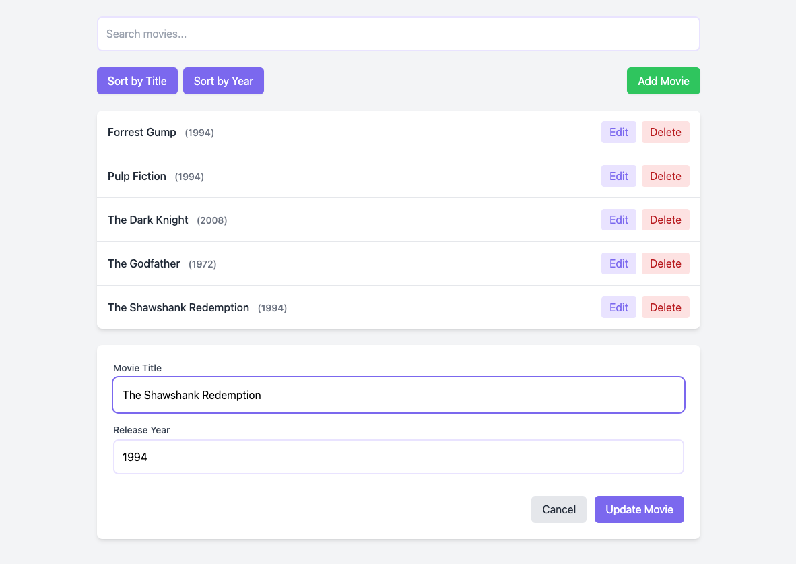

*This README was generated by an AI because I'm too lazy to write it myself 😴*

# Movies RxAngular Zoneless



## Description

This is a test app to explore and play with RxAngular and zoneless change detection in Angular. The app lets you manage a list of movies, including adding, editing, deleting, and sorting movies by title or year. It uses RxAngular for state management and zoneless change detection for better performance.

## Features

- **Add Movie**: Add a new movie to the list.
- **Edit Movie**: Edit the details of an existing movie.
- **Delete Movie**: Remove a movie from the list.
- **Search Movies**: Filter movies by title.
- **Sort Movies**: Sort movies by title or year.

## Technologies Used

- **Angular**: Framework for building the app.
- **RxAngular**: State management and reactive programming.
- **Zoneless Change Detection**: Experimental feature for better performance.
- **Tailwind CSS**: Styling the app.

## Getting Started

### Prerequisites

- Node.js
- pnpm

### Installation

1. Clone the repository:
   ```bash
   git clone https://github.com/michalgrzegorczyk-dev/movies-rxangular-zoneless.git
   ```
2. Navigate to the project directory:
   ```bash
   cd movies-rxangular-zoneless
   ```
3. Install the dependencies:
   ```bash
   pnpm install
   ```

### Running the Application

1. Start the development server:
   ```bash
   pnpm start
   ```
2. Open your browser and go to `http://localhost:4200`.

## Project Structure

- `src/app/components/dumb`: Contains presentational components.
- `src/app/components/smart`: Contains container components.
- `src/app/services`: Contains services for data fetching and manipulation.
- `src/app/types`: Contains TypeScript types and interfaces.
- `src/app/utils`: Contains utility functions.

## License

This project is licensed under the MIT License. See the `LICENSE` file for details.
